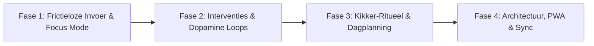

# 🐸 Frogeater: Momentum Editorial Task Canvas
## Product Roadmap & Verbeterplan

Dit document beschrijft de analyse en de strategische roadmap voor het doorontwikkelen van **Frogeater (Momentum)**: een gespecialiseerde anti-uitstel webapplicatie gebaseerd op gedragspsychologie, de WOOP-methode, de 2-minutenregel en het *Eat That Frog*-principe.

---

## 1. Huidige Kern & Psychologische Pijlers

De applicatie pakt uitstelgedrag aan via vier beproefde mechanismen:
1. **WOOP-structuur (Wish, Outcome, Obstacle, Plan):**
   * Doel: Concreet resultaat visualiseren.
   * Blokkade & Weerstand: Benoemen van angst, saaiheid of overweldiging (Dread Level 1-5 🔥).
   * Als/Dan Implementatie Intenties.
2. **Micro-Momentum & 2-Minuten Regel (BJ Fogg / David Allen):**
   * Forceren van een belachelijk kleine eerste stap (< 2 minuten) om de initiële drempel weg te nemen.
3. **Kikker-Prioritering (*Eat That Frog*):**
   * Identificatie van zware weerstandstaken (Dread Level 4-5) om de belangrijkste drempel van de dag als eerste te slechten.
4. **Auditieve Feedback (Web Audio API Engine):**
   * Tactiele kliks, tikkende timers en harmonische beloningsakkoorden zonder externe assets.

---

## 2. Visueel Overzicht van de Roadmap

---

## 3. Gedetailleerde Roadmap per Fase

### 📌 Fase 1: Frictieloze Invoer & Focus Mode (Korte Termijn / Quick-wins)
*Doel: Het verlagen van de initiële invoerdrempel en het creëren van een afleidingsvrije sprint-omgeving.*

- [x] **Zen / Fullscreen Focus Sprint:**
  - Zodra de 2-minuten timer start, opent de afleidingsvrije Zen-modus (of via de `ZEN FOCUS` knop).
  - Enkel de actieve micro-stap, het gewenste resultaat, een grote SVG circulaire countdown timer en micro-stappen beheer zijn zichtbaar.
  - Sneltoetsen: `Spatie` (start/pauze), `Esc` (verlaten), `Enter` / `C` (stap voltooien), `R` (timer herstarten).
  - Flow State momentum-verlenging (`+5 min Flow Sprint`).
- [x] **Quick Brain Dump / Fast-Track Invoer:**
  - Minimalistische 10-seconden invoeroptie (taaknaam & optionele eerste micro-stap) om de drempel bij acute vermijding weg te nemen.
  - Automatische toekenning van standaarden en een 1-klik `Vul WOOP aan →` actie in de inspector om de taak later te verrijken.
- [ ] **Ambient Soundscapes (Web Audio API):**
  - Synthese van rustgevende achtergrondgeluiden tijdens focusblokken (bijv. Brown Noise, White Noise, zachte regen of binaural beats).

---

### 📌 Fase 2: Geavanceerde Anti-Uitstel Interventies & Psychologie
*Doel: Gebruikers direct redden wanneer ze tijdens een taak alsnog blokkeren of vastlopen.*

- [ ] **De "Noodrem / Ik zit vast"-knop (Micro-Slicer):**
  - **Stap Halveren:** Knip een stap van 2 minuten automatisch op naar een 30-seconden versie (bijv. *"Open alleen het tabblad en kijk ernaar"*).
  - **Slechte Eerste Versie Nudge:** Expliciete toestemming om een rommelige opzet (cijfer 4) af te leveren.
  - **30s Somatische Reset:** Korte ademhalingsoefening of visualisatie bij angst/blokkades.
- [ ] **"Warm Handoff" (Parkeernotitie bij pauzeren):**
  - Wanneer de gebruiker de taak pauzeert: vraag *"Waar ga je over 10 seconden direct mee verder als je terugkeert?"*.
  - Dit voorkomt herstart-drempels bij het hervatten.
- [ ] **Dopamine & Kikker-Beloningsceremonie:**
  - Visuele animatie bij het afronden van een 'Kikker' (Dread 4-5).
  - Zege-log waarin behaalde overwinningen visueel worden gevierd.

---

### 📌 Fase 3: Kikker-Ritueel & Slimme Dagplanning
*Doel: Keuzestress verminderen en een dagelijkse routine rondom moeilijke taken bouwen.*

- [ ] **"Kikker van de Dag" Spotlight:**
  - Mogelijkheid om expliciet **één** primaire kikker voor de ochtend te selecteren om keuzeverlamming (*decision fatigue*) tegen te gaan.
- [ ] **Micro-Step Sjablonen:**
  - Voorgedefinieerde micro-stap sjablonen voor typische uitsteltaken:
    - *Moeilijke e-mail / telefoontje*
    - *Belasting / administratie / facturen*
    - *Groot rapport / schrijfwerk*
    - *Opruimen / huishoudelijke taak*
- [ ] **Anti-Schuld Momentum Statistieken:**
  - Geen ontmoedigende 'broken streak' straffen.
  - Positieve metrics: aantal overwonnen micro-stappen, doorbroken weerstandspunten en totale focustijd.

---

### 📌 Fase 4: Technische Architectuur, PWA & Data
*Doel: Een robuuste, modulaire en overal beschikbare applicatie.*

- [x] **Data Schema & Supabase Realtime Cloud Sync:**
  - Hybride offline-first synchronisatie met Supabase Realtime websockets.
  - In-app verbindingsmodal met live statusindicator en 1-klik lokale taken upload.
  - Automatische synchronisatie tussen meerdere pc's en browsers.
- [ ] **PWA (Progressive Web App) & Offline Support:**
  - Installeren als stand-alone desktop en mobiele app met offline werking.
- [ ] **Modulaire Projectstructuur (Vite + TypeScript + Tailwind):**
  - Verdere modularisatie van subcomponenten.

---

*Gegenereerd voor Frogeater — Focus op Oplevering & Momentum.*
